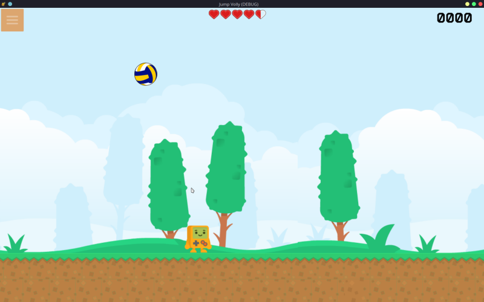
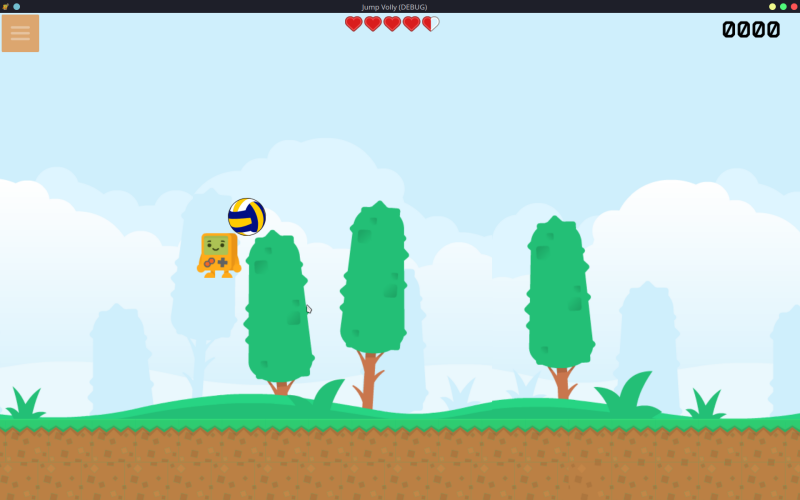

# Jump Volly

### Introduction

This is the very first game I have developed. The game is open source lice need under GNU GPL v3, the source code of the game is available on https://github.com/bauripalash/jumpvolly

### Screenshots

### How to Play
Your goal in this game is to hit the ball with the character as many times as possible, gaining points and preventing the ball from touching the ground, loosing health. You have total 10 health, with this score as much as possible and create high scores.

### Controls

* Computer/Web: pressing the **Left Arrow key** and **A** will move the character to left and pressing the **Right Arrow key** and **D** will move the character to right. As soon as you release those keys, the character will jump.
* Mobile: Tapping left side of the screen moves the character to the left; tapping the righting side moves the character to the right. Releasing them make the character jump.

Have fun!

### Credits
Most game assets are from Kenney’s assets ([kenney.nl](https://www.kenney.nl)) such as the character, the background, the floor platform, the volleyball is from openclipart.org. The font used is Générale Station, licensed under SIL Open Font License (OFL) version 1.1. See [Artworks/LICENSE.md](https://github.com/bauripalash/jumpvolly/blob/main/Artworks/LICENSE.md) for more information
